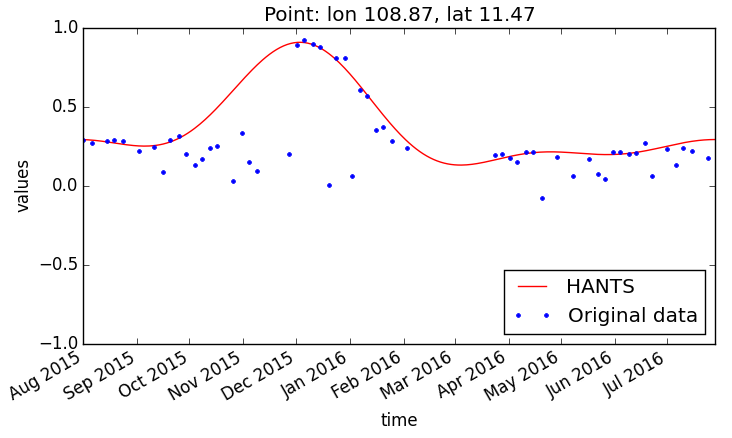

# Harmonic ANalysis of Time Series (HANTS)

This repository is a python implementation of the Harmonic ANalysis of Time Series (HANTS) applied to geospatial data. The python module can be used to perform the HANTS analysis to a collection of time-variable raster data at each pixel.

 

## How to use the code
There are two software options to run HANTS on python:
- gdal
- arcpy

The two options are equivalent, the only difference is about the underlying library to process the geospatial data.

### <a name="gdal_example"></a>Example 1 - GDAL

```python
from hants import wa_gdal

# Data parameters
rasters_path = r'C:\example\data'
name_format = 'PROBAV_S1_TOC_{0}_100M_V001.tif'
start_date = '2015-08-01'
end_date = '2016-07-28'
latlim = [11.4505, 11.4753]
lonlim = [108.8605, 108.8902]
cellsize = 0.00099162627
nc_path = r'C:\example\ndvi_probav.nc'
rasters_path_out = r'C:\example\output_rasters'

# HANTS parameters
nb = 365
nf = 3
low = -1
high = 1
HiLo = 'Lo'
fet = 0.05
delta = 0.25
dod = 1

# Run
wa_gdal.run_HANTS(rasters_path, name_format,
                  start_date, end_date, latlim, lonlim, cellsize, nc_path,
                  nb, nf, HiLo, low, high, fet, dod, delta,
                  4326, -9999.0, rasters_path_out)

# Check fit
point = [108.87, 11.47]
ylim = [-1, 1]
wa_gdal.plot_point(nc_path, point, ylim)
```

### <a name="gdal_example"></a>Example 2 - arcpy

```python
from hants import wa_arcpy

# Create netcdf file
rasters_path = r'C:\example\data'
name_format = 'PROBAV_S1_TOC_{0}_100M_V001.tif'
start_date = '2015-08-01'
end_date = '2016-07-28'
latlim = [11.4505, 11.4753]
lonlim = [108.8605, 108.8902]
cellsize = 0.00099162627
nc_path = r'C:\example\ndvi_probav.nc'
wa_arcpy.create_netcdf(rasters_path, name_format, start_date, end_date,
                       latlim, lonlim, cellsize, nc_path)
# Run HANTS
nb = 365
nf = 3
low = -1
high = 1
HiLo = 'Lo'
fet = 0.05
delta = 0.25
dod = 1
wa_arcpy.HANTS_netcdf(nc_path, nb, nf, HiLo, low, high, fet, dod, delta)

# Check fit
point = [108.87, 11.47]
ylim = [-1, 1]
wa_arcpy.plot_point(nc_path, point, ylim)

# Export rasters
rasters_path_out = r'C:\example\output_rasters'
wa_arcpy.export_tiffs(rasters_path_out, nc_path, name_format)
```
## Contact

**Gonzalo E. Espinoza, PhD, MSc**  
Integrated Water Systems and Governance  
IHE Delft Institute for Water Education  
T: [+31 15 2152313](tel:+31152152313)  
E: [g.espinoza@un-ihe.org](mailto:gespinoza@utexas.edu)  
I: [un-ihe.org](http://un-ihe.org) | [wateraccounting.org](http://wateraccounting.org) | [gespinoza.org](http://gespinoza.org)  

## Citation
> Espinoza-Dávalos, G.E., Bastiaanssen, W.G.M., Bett, B., and Cai, X. (2017). *A Python Implementation of the Harmonic ANalysis of Time Series (HANTS) Algorithm for Geospatial Data.* GitHub. https://github.com/gespinoza/hants
